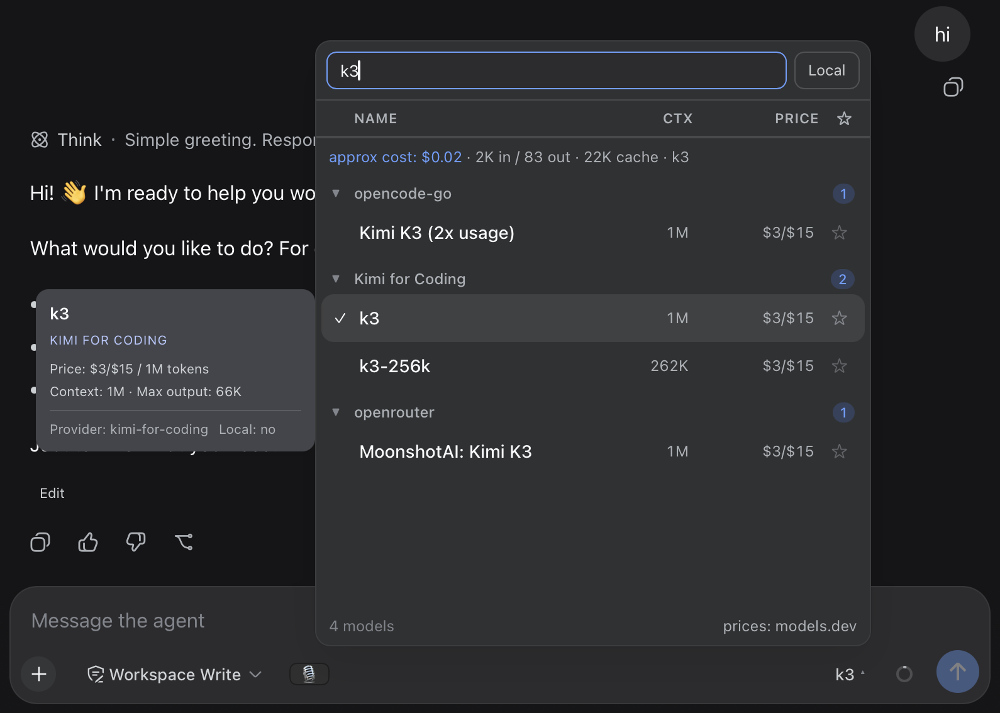

# dsh-model-garden

A searchable, sortable **model picker** for the [DeepSeek Harness](https://github.com/deepseek-ai) Web UI (`dsh web`). It replaces the native composer model seat with a table-style picker that adds everything the stock selector is missing:

 [](https://www.npmjs.com/package/dsh-model-garden) 



## Features

- **🔍 Instant search** across model names and descriptions
- **📊 Sortable table columns** — click `Name`, `Ctx` or `Price` to sort asc/desc; a third click returns to the provider-grouped view
- **⭐ Favorites** — star models, toggle favorites-only from the table header; persisted in `localStorage`
- **🏠 Local tag** — providers are flagged *local* by their real endpoint (baseURL from settings: loopback / RFC1918 / LAN hostnames), never by price guesswork; the **Local** box next to the search input filters to them
- **▾ Collapsible provider groups** — collapse state is persisted per provider
- **💰 Model prices** from [models.dev](https://models.dev) (the same source OpenCode uses), shown as `$input/$output` per 1M tokens, cached for 24 h. **Subscription routes** (all-zero cost in the catalog, e.g. coding-plan providers) resolve a *reference price* from their pay-as-you-go provider via `PROVIDER_ALIASES`, so plan models still show what their tokens would cost at API rates; only true **local** models stay unpriced
- **🧠 Context windows** — read live from the host `llm` service (adapter-owned data, works for **local** providers like llama.cpp / Ollama-style gateways too), with models.dev as fallback
- **🎚️ Reasoning effort picker** — models that support reasoning levels get a compact dropdown right next to the model name in the chat composer, styled and opening **exactly like the model picker** (same trigger pill, same floating menu surface, ✓ marks the active level, click outside / `Esc` / selecting closes it). Picking a level re-selects the current model with that effort — no clutter inside the picker panel
- **💸 Live per-task usage & cost** — real provider-reported token usage (from the session log) is **always shown** while the panel is open (`in / out / cache`). Each model's usage is multiplied by **its own** (reference) price — properly attributed even when a session switched models mid-way — the same math OpenCode uses (`usage × price`, not a heuristic)
- **🧾 Session cost breakdown** — hover the `approx cost` figure for a popup **sized like the picker and parked parallel on its left (1 px gap)**: per-model totals (steps, tokens, ≈ cost), a scrollable timestamped step list (date + time, in/out/cache) and a **copy button** for the token breakdown. The invisible hover target spans the cost row all the way to its left edge. Attribution of each step to its model comes straight from the session log (`request/context` events); nothing extra is stored
- **🖱️ Detail tooltip** that opens *beside* the panel (never covers the list): description, price, context window, max output, reasoning efforts
- **🎨 Native look** — built entirely on the harness design tokens (`--dsw-alias-*`); the picker panel, the effort menu, the detail tooltip and the cost popup all share the same surface color and geometry, matching light & dark theme automatically

## How it works

The package is a **static profile plugin** with two halves:

| Half | File | Role |
|---|---|---|
| Client | `client.js` | Registers the `conversation.input.model` slot (priority `-1`, shadowing the native seat) and renders the picker |
| Host | `index.js` | Serves three same-origin JSON routes on the harness `webServer` service |

### Host endpoints

```
GET /model-garden/cost?session=<sessionId>
  → { inputTokens, outputTokens, cacheReadTokens, cacheWriteTokens, reasoningTokens, steps }

GET /model-garden/cost-history?session=<sessionId>&limit=<n>
  → { steps: [ { time, provider, model, turn, step, inputTokens, outputTokens, cacheReadTokens, cacheWriteTokens, reasoningTokens } ] (newest first, capped),
      models: [ { provider, model, steps, inputTokens, outputTokens, cacheReadTokens, cacheWriteTokens } ],
      totalSteps }

GET /model-garden/catalog
  → { "provider::model": { local, context?, maxOutput? } }   (cached 10 min)
```

The cost endpoint aggregates the real `usage` payloads of `assistant/message` events from the durable session log — no estimation. The cost-history endpoint additionally attributes each usage step to the model in effect: `assistant/message` events carry usage but not the model, so it tracks `request/context` (and `request/header`) events, which precede the request they describe with `{ provider, model }` — a single pass over the same in-memory events, no extra persistence. The catalog endpoint resolves `contextWindow` / `defaultMaxTokens` per model through the host `llm` service (`resolveModelInfo`), so local/self-hosted providers report their real limits.

## Installation

One command — the official plugin CLI installs the package **and** mounts it (the package carries a `dsh.bundle.patch` layer, so the CLI automatically appends it to the profile's bundle stack):

```sh
dsh plugin --profile <profile> add dsh-model-garden
```

Then restart the DSH server and hard-refresh the browser (`Cmd/Ctrl+Shift+R`).

> The host half needs the web stack (`webServer` service). In minimal/TUI profiles without it the plugin stays inert by design — boot is never blocked.

> Upgrading from a manual install? Remove the old `model-garden` dependency and any manual `- insert:` row for it from your profile's `cordis.patch.yml` first — otherwise the plugin mounts twice.

### Verify

```bash
curl -s http://127.0.0.1:3080/model-garden/catalog | head -c 200
# → {"deepseek::deepseek-chat":{"local":false,"context":...}, ...}  (JSON, not HTML)
```

### Manual install (without the CLI)

If you manage the profile with plain npm: add the dependency, list `dsh-model-garden` in `dsh.profile.bundles` in the profile `package.json`, reinstall, restart. The bundle patch inside the package inserts the loader row for you — no `cordis.patch.yml` edit needed.

## Configuration

No configuration is required. Two behaviors can be adjusted at the top of the respective file:

- **Hidden provider routes** — `HIDDEN_PROVIDER_PREFIXES` in `client.js` (and `SKIP_PREFIXES` in `index.js`). Some plugins mirror providers as internal routes (e.g. a vision toolkit duplicating every provider as `vision-toolkit-<id>`); such prefixes are excluded from the picker and the catalog.
- **Price aliases** — `PROVIDER_ALIASES` / `MODEL_ALIASES` in `client.js` map DSH route ids to models.dev catalog ids. They serve two cases: renamed routes (`deepseek-official` → `deepseek`) and subscription routes whose catalog entry is all-zero (`kimi-for-coding` → `moonshotai`, `alibaba-tp` → `alibaba-cn`, `oneprovider` → `anthropic`), giving plan models their pay-as-you-go reference price.
- **Price cache TTL** — `PRICE_TTL` (default 24 h) and **catalog TTL** — `CATALOG_TTL` (default 10 min).

Favorites, collapsed providers and the price cache live in the browser's `localStorage` under `dsh.modelgarden.*`.

## Compatibility

Developed and tested against DeepSeek Harness `0.1.0-rc.8` (`@deepseek-ai/dsh-host-webserver`, `dsh-session`, `dsh-llm`, `dsh-client-ui-model-selection`); first released against `0.1.0-rc.6`. The client half is plain React via `window.__ModuleLoader__` — no build step, no dependencies.

## Credits

- Pricing data: [models.dev](https://models.dev) API (also used by [OpenCode](https://github.com/anomalyco/opencode))
- Design tokens & slot API: DeepSeek Harness

## License

[MIT](LICENSE)
