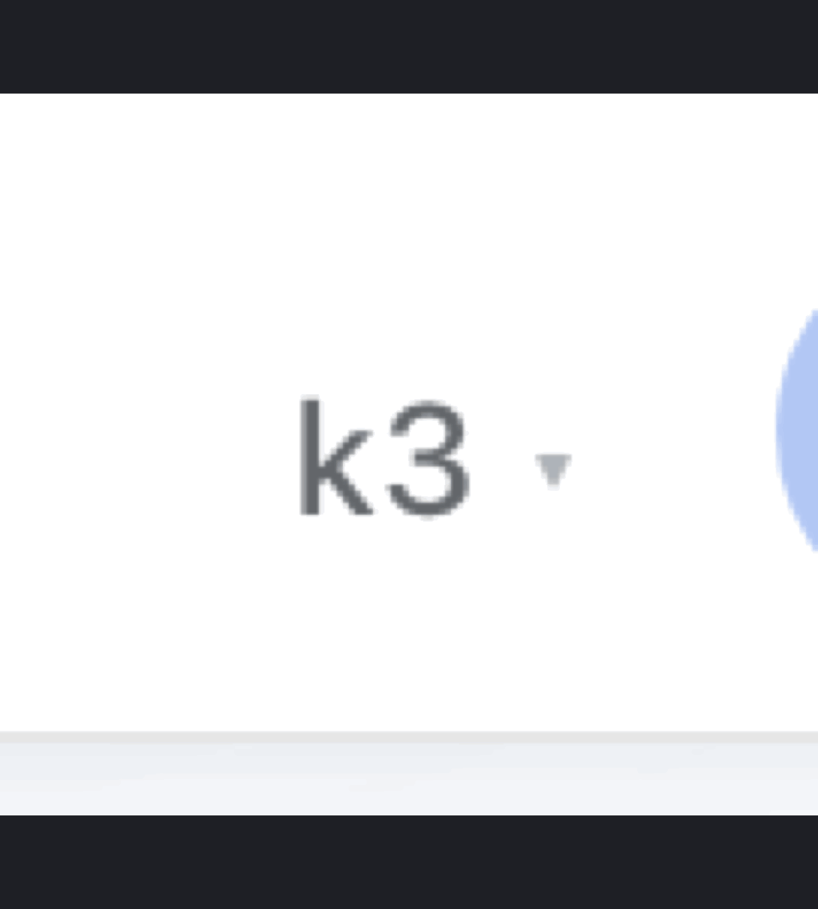

# dsh-model-garden

A searchable, sortable **model picker** for the [DeepSeek Harness](https://github.com/deepseek-ai) Web UI (`dsh web`). It replaces the native composer model seat with a table-style picker that adds everything the stock selector is missing:

 



## Features

- **🔍 Instant search** across model names and descriptions
- **📊 Sortable table columns** — click `Name`, `Ctx` or `Price` to sort asc/desc; a third click returns to the provider-grouped view
- **⭐ Favorites** — star models, toggle favorites-only from the table header; persisted in `localStorage`
- **▾ Collapsible provider groups** — collapse state is persisted per provider
- **💰 Model prices** from [models.dev](https://models.dev) (the same source OpenCode uses), shown as `$input/$output` per 1M tokens, cached for 24 h
- **🧠 Context windows** — read live from the host `llm` service (adapter-owned data, works for **local** providers like llama.cpp / Ollama-style gateways too), with models.dev as fallback
- **💸 Live per-task cost** — real provider-reported token usage (from the session log) × current model price, refreshed while the panel is open — the same math OpenCode uses (`usage × price`, not a heuristic)
- **🖱️ Detail tooltip** that opens *beside* the panel (never covers the list): description, price, context window, max output, reasoning efforts
- **🎨 Native look** — built entirely on the harness design tokens (`--dsw-alias-*`), matches light & dark theme automatically

## How it works

The package is a **static profile plugin** with two halves:

| Half | File | Role |
|---|---|---|
| Client | `client.js` | Registers the `conversation.input.model` slot (priority `-1`, shadowing the native seat) and renders the picker |
| Host | `index.js` | Serves two same-origin JSON routes on the harness `webServer` service |

### Host endpoints

```
GET /model-garden/cost?session=<sessionId>
  → { inputTokens, outputTokens, cacheReadTokens, cacheWriteTokens, reasoningTokens, steps }

GET /model-garden/catalog
  → { "provider::model": { context?, maxOutput? } }   (cached 10 min)
```

The cost endpoint aggregates the real `usage` payloads of `assistant/message` events from the durable session log — no estimation. The catalog endpoint resolves `contextWindow` / `defaultMaxTokens` per model through the host `llm` service (`resolveModelInfo`), so local/self-hosted providers report their real limits.

## Installation

Model Garden mounts into a **DSH profile** (e.g. `~/.dsh/profiles/<your-profile>`).

1. **Copy the plugin into your profile:**

   ```bash
   mkdir -p ~/.dsh/profiles/<profile>/plugins/model-garden
   cp index.js client.js package.json ~/.dsh/profiles/<profile>/plugins/model-garden/
   ```

   (Or publish/consume via any `file:` path you prefer.)

2. **Add the dependency** to `~/.dsh/profiles/<profile>/package.json`:

   ```json
   {
     "dependencies": {
       "model-garden": "file:plugins/model-garden"
     }
   }
   ```

   then `npm install --legacy-peer-deps` inside the profile directory.

   > ⚠️ Do **not** add it to `dsh.profile.bundles` — it is a plain client plugin (`dsh.client.platform: "web"`), not a patch bundle.

3. **Register the loader row** in `~/.dsh/profiles/<profile>/cordis.patch.yml`:

   ```yaml
   - insert:
       - id: model-garden
         name: 'model-garden'
   ```

4. **Restart the DSH server** and hard-refresh the browser (`Cmd/Ctrl+Shift+R`). Static client bundles are read at boot, so a restart is required after every upgrade.

### Verify

```bash
curl -s http://127.0.0.1:3080/model-garden/catalog | head -c 200
# → {"deepseek::deepseek-chat":{"context":...}, ...}  (JSON, not HTML)
```

## Configuration

No configuration is required. Two behaviors can be adjusted at the top of the respective file:

- **Hidden provider routes** — `HIDDEN_PROVIDER_PREFIXES` in `client.js` (and `SKIP_PREFIXES` in `index.js`). Some plugins mirror providers as internal routes (e.g. a vision toolkit duplicating every provider as `vision-toolkit-<id>`); such prefixes are excluded from the picker and the catalog.
- **Price cache TTL** — `PRICE_TTL` (default 24 h) and **catalog TTL** — `CATALOG_TTL` (default 10 min).

Favorites, collapsed providers and the price cache live in the browser's `localStorage` under `dsh.modelgarden.*`.

## Compatibility

Developed against DeepSeek Harness `0.1.0-rc.6` (`@deepseek-ai/dsh-host-webserver`, `dsh-session`, `dsh-llm`, `dsh-client-ui-model-selection`). The client half is plain React via `window.__ModuleLoader__` — no build step, no dependencies.

## Credits

- Pricing data: [models.dev](https://models.dev) API (also used by [OpenCode](https://github.com/anomalyco/opencode))
- Design tokens & slot API: DeepSeek Harness

## License

[MIT](LICENSE)
